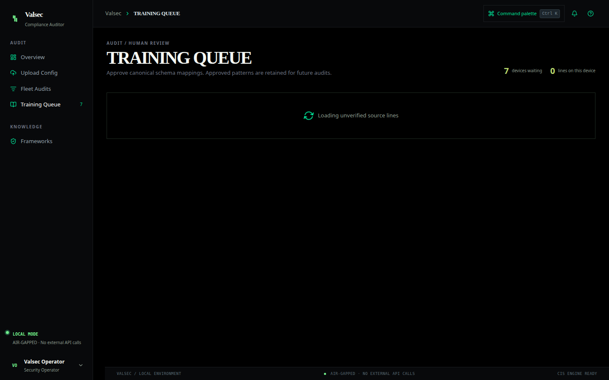
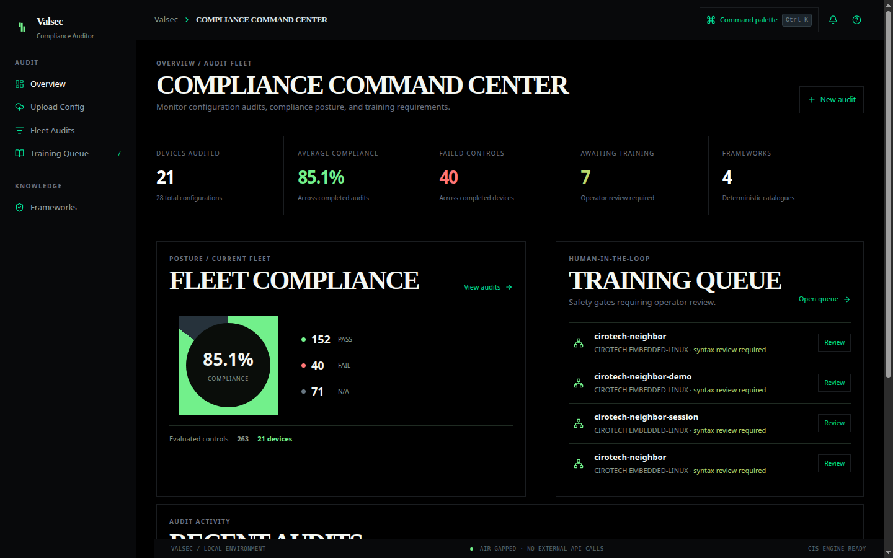
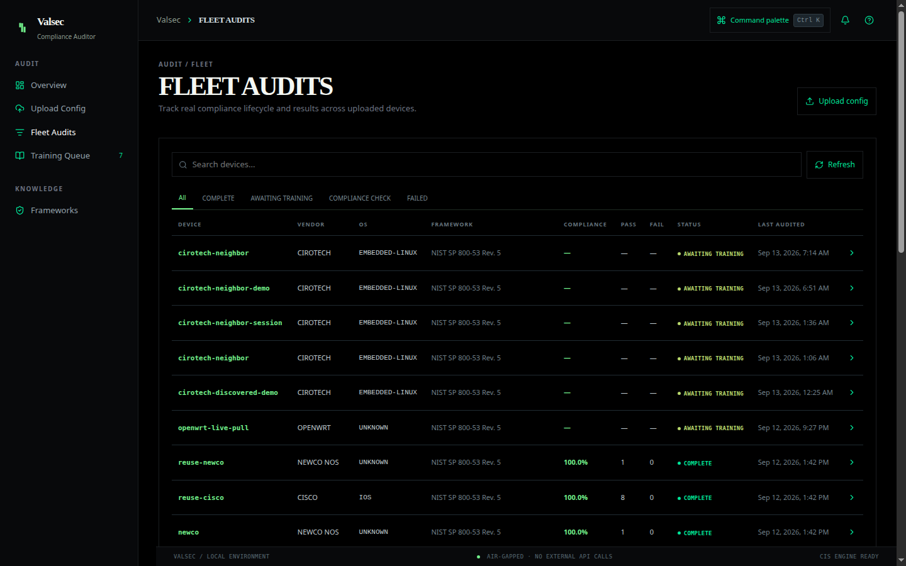
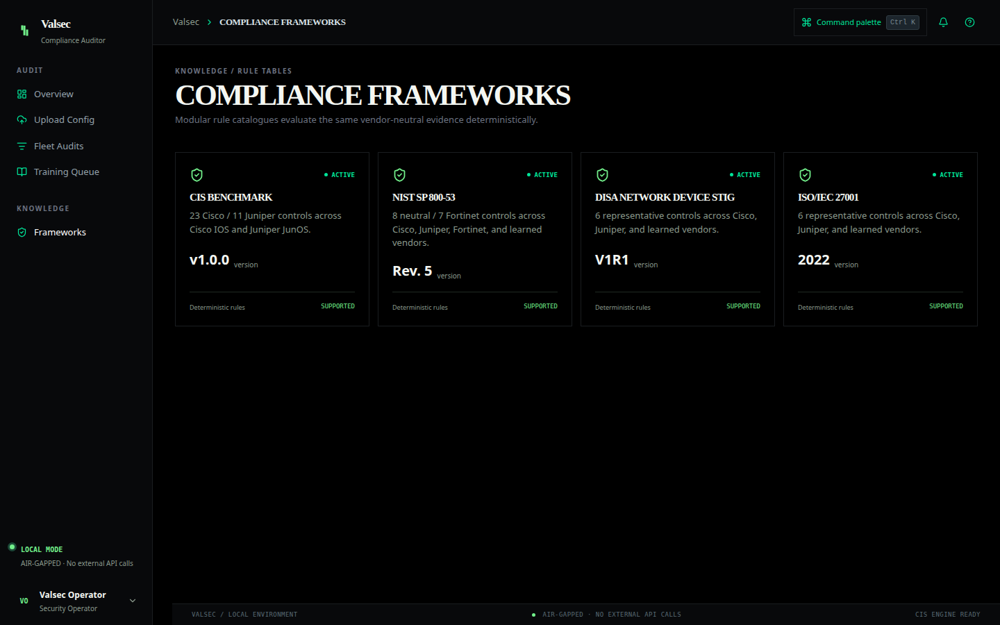

# Valsec - AI-Driven Multi-Vendor Network Security Compliance Auditor

Valsec is a local-first, AI-driven multi-vendor network security compliance auditor for controlled institutional and enterprise networks. It normalizes Cisco IOS/IOS-XE, Juniper JunOS, and Fortinet FortiOS configurations into one vendor-neutral schema, evaluates deterministic framework rules, generates reviewable vendor CLI remediation, and produces a Valsec PDF report.

Valsec supports routers, switches, and firewalls through Cisco, Juniper, and Fortinet adapters. An unsupported vendor can be onboarded without a parser: Valsec preserves its vendor identifier, proposes schema mappings with local Ollama, requires operator approval, and reuses approved mappings only for the same user and vendor.




AI can propose schema mappings and remediation text. It cannot determine PASS, FAIL, N/A, severity, or score.




## Capabilities

- Single-file, multi-file, and safe ZIP ingestion, with an independent audit per device.
- Per-file detection for mixed Cisco, Juniper, Fortinet, and unknown-vendor batches.
- ZIP traversal checks, member/count/size limits, filename validation, and ownership checks.
- Source-backed normalization with `confirmed`, `probable`, and `unverified` confidence.
- Human approval gate before proposed mappings become `confirmed`.
- Persistent mappings isolated by authenticated user and vendor.
- Deterministic CIS Cisco IOS (23 controls), CIS Juniper (11 controls), NIST SP 800-53 Rev. 5 (8 neutral controls and 7 Fortinet controls), DISA Network Device STIG V1R1 (6 controls), and ISO/IEC 27001:2022 Annex A (6 controls).
- Deterministic Cisco, Juniper, and FortiOS remediation where a template exists; validated local Ollama fallback is explicitly marked for review.
- Valsec-branded PDF with device identity, framework, score, verdicts, severity, evidence, requirements, and remediation.
- Valsec dashboard connected to the real FastAPI endpoints.
- Local SSH pull and authenticated seed-based neighbor discovery into the existing audit lifecycle, using fixed read-only commands and resolve-then-pin target validation.
- Operator-approved remediation push with Cisco running-config-only application, Junos confirmed commits, post-change re-pull, and a visible configuration diff.
- Persistent breadth-first discovery sessions using CDP/LLDP where present and kernel neighbor/ARP evidence as a passive fallback. Eligible advertised neighbors can be processed automatically; evidence-only candidates pause for their missing fixed profile and credentials before entering the existing audit pipeline.
- Durable device registry with audit history, baseline selection, deterministic control/raw-config drift, and latest-audit fleet summaries.



- Process liveness and dependency readiness endpoints, configurable Celery concurrency, and healthchecked Compose services.
- Opt-in Fernet-encrypted device credentials for manual SSH pulls, with owner scoping and append-only access events. The vault is disabled by default.
- Organization-scoped Network Missions that connect a registered seed to bounded authenticated CDP/LLDP discovery, stored-credential collection, the existing deterministic audit lifecycle, grouped fleet findings, and explicitly approved per-device remediation.




The non-CIS catalogues are representative technical control mappings for a demonstration. They are not full certification or accreditation coverage.

## Start with Docker

Requirements: Docker Compose and a local Ollama service with `qwen2.5:7b` when AI proposals are desired.

```bash
cp .env.example .env
docker compose up -d --build
```

Open `http://localhost:3000`. FastAPI is at `http://localhost:8000`; PostgreSQL is bound to localhost port 5432 and Redis to localhost port 6380. Ollama is reached through `host.docker.internal:11434` by default. If Ollama is unavailable, audits still enter manual training.

For any exposed or authenticated deployment, replace `POSTGRES_PASSWORD` and `SECRET_KEY`, set `VALSEC_ENV=production`, use TLS, and configure the allowed origin and cookie settings.

## API

- `POST /api/configs/upload`: raw text, one file, multiple files, or ZIP; accepts framework, fallback vendor, and optional per-file vendor hints.
- `GET /api/configs`: fleet/audit list.
- `GET /api/configs/{id}/status`: lifecycle and pending review count.
- `GET /api/configs/{id}/results`: deterministic compliance results and remediation.
- `GET /api/configs/{id}/report`: authorized PDF download.
- `GET /api/configs/{id}/unverified`: unverified/probable lines and any validated AI proposal.
- `POST /api/configs/{id}/train`: approve a mapping and resume once all findings are confirmed.
- `POST /api/configs/pull-device`: fetch a LAN device configuration over SSH and queue it through the same audit pipeline as an upload.
- `POST /api/configs/discover-neighbors`: authenticate to a seed and return LLDP/kernel-neighbor evidence without scanning the subnet.
- `POST /api/configs/pull-discovered-device`: revalidate a selected discovered address, pull through a fixed SSH or Cirotech Telnet profile, and queue the existing audit.
- `POST /api/configs/discovery-sessions`: persist a bounded BFS session and automatically process eligible advertised neighbors.
- `GET /api/configs/discovery-sessions/{id}`: return discovered devices, linked Config IDs, and live audit states.
- `POST /api/configs/discovery-sessions/{id}/devices/{device_id}/process`: supply a passive candidate's missing fixed profile/credentials, then reuse normal pull/audit ingestion.
- `POST /api/configs/discovery-sessions/{id}/devices/{device_id}/skip`: mark passive host evidence as not a router for this session.
- `POST /api/configs/{id}/findings/{finding_id}/approve-remediation`: freeze the existing remediation text after operator review.
- `POST /api/configs/{id}/findings/{finding_id}/apply-remediation`: apply only that approved text and return before/after snapshots and a unified diff.
- `GET /api/devices` and `GET/PATCH /api/devices/{id}`: paginated owned inventory, current score, metadata, and decommissioning.
- `GET /api/devices/{id}/history`: every linked configuration audit without deleting decommissioned-device history.
- `POST /api/devices/{id}/baseline` and `GET /api/devices/{id}/drift`: completed-audit baseline selection and deterministic drift.
- `GET /api/fleet/summary`: active-device status, latest-completed score distribution, failing controls, and stale devices.
- `GET /health` and `GET /ready`: process liveness and bounded DB/Redis/Ollama dependency checks.
- `POST/GET /api/devices/{id}/credentials` and `DELETE /api/devices/{id}/credentials/{credential_id}`: opt-in credential storage, metadata listing, and revocation; plaintext is never returned.
- `POST/GET /api/devices/{id}/schedules` and `PATCH/DELETE /api/devices/{id}/schedules/{schedule_id}`: fixed-interval recurring audits using stored credentials.
- `GET /api/organizations/{org_id}/schedules`: owner/operator organization-wide schedule view.
- `PATCH /api/organizations/{org_id}/remediation-policy`: owner-only control for requiring a different campaign approver.
- `POST/GET /api/network-missions` and `GET /api/network-missions/{id}`: create, list, and inspect bounded seed-to-fleet operations.
- `POST /api/network-missions/{id}/start`: queue authenticated discovery and stored-credential collection; task messages contain IDs, never device secrets.
- `GET /api/network-missions/{id}/devices|findings|summary`: inspect topology evidence, eligibility reasons, linked audits, grouped failures, and posture.
- `POST/GET /api/network-missions/{id}/remediation-campaigns`: group one deterministic control remediation into vendor-aware per-device targets.
- `POST /api/remediation-campaigns/{id}/approve|execute` and `GET .../results`: explicit owner approval followed by independently verified device jobs.

Request-supplied device credentials remain request-only and are never stored. Under `REQUIRE_AUTH=true`, pull and discovery require the authenticated device owner; remediation approval and PUSH remain local-only. Cisco push changes running configuration only; startup persistence remains a separate manual action. Junos uses `commit confirmed 5`, verifies reachability, then commits permanently. Risky generic/UCI changes are always refused because no automatic rollback is available.

The credential vault, schedule, and Network Mission endpoints remain unavailable unless `ENABLE_CREDENTIAL_VAULT=true`; vault encryption uses a dedicated `CREDENTIAL_VAULT_KEY` and never reuses `SECRET_KEY`. With authentication enabled, device access follows Organization membership roles. The legacy manual PUSH endpoint remains local-only; a mission campaign is a separate owner-approved organization path that retrieves a device-bound credential server-side and still calls the same safe per-device connector.

Recurring audits use one Celery Beat poll every 60 seconds by default
(`SCHEDULE_POLL_SECONDS`). Scheduled pull and compliance tasks use the dedicated
`scheduled_audits` queue, keeping the default queue available for interactive
uploads. Run Beat and a queue-specific worker alongside the normal worker:

```bash
cd backend
celery -A tasks.celery_app beat --loglevel=info
celery -A tasks.celery_app worker --loglevel=info -Q scheduled_audits -n scheduled@%h
```

Transient reachability failures use bounded Celery retry/backoff; authentication
failures are not retried. After `SCHEDULE_FAILURE_THRESHOLD` consecutive
failures (default `3`), the schedule is automatically disabled with its reason
in `last_run_status`. A schedule created without a credential is disabled in
the explicit `awaiting_credential` state until a device credential is attached.

Recurring-audit migration `f1a4c7d92e63` is purely additive: it adds one table,
one queue, and schedule endpoints; it does not rewrite existing data. The retry and auto-disable defaults should
still be sanity-checked against real fleet behavior before unattended use.

## Network Missions

A Network Mission is one traceable operation rooted at a registered seed
device. It stores the organization, operator, framework, requested CIDRs,
depth/device limits, discovered evidence, linked Config audits, campaign
targets, and sanitized state events. Open `/network-missions` to create and
inspect one.

Mission discovery never enumerates a CIDR. It authenticates only to the seed
and then to devices identified through that device's fixed CDP/LLDP neighbor
commands. ARP/kernel-neighbor entries remain visible evidence but are marked
unsupported until identity is established; Valsec never tries credentials
against them. A node is collected only when it is inside the mission CIDRs,
has a supported fixed connector, belongs to the same organization, and has a
credential stored specifically for that Device.

`AUTHORIZED_NETWORKS` optionally sets a deployment-wide administrator ceiling.
Every mission must submit at least one CIDR and each CIDR must be within that
ceiling when configured. The same central resolve-and-pin guard is called by
discovery, pull, and remediation. Defaults remain bounded by
`DISCOVERY_MAX_DEPTH=3`, `DISCOVERY_MAX_DEVICES=25`, and
`MISSION_MAX_CONCURRENT_OPERATIONS=5`.

Mission task messages contain only mission/device/target UUIDs. Credentials are
decrypted inside the worker for one connector call and attributed with
`network_mission_discovery`, `network_mission_pull`, or
`network_mission_remediation`. Configs enter the normal audit worker unchanged.
Only deterministic, non-AI-fallback remediation text can seed a campaign.
Creating a campaign never approves it; an owner must explicitly approve the
stored per-device actions before an owner/operator can dispatch them. Each job
uses the existing snapshot, apply, re-pull verification, diff, and Junos
confirmed-commit rollback behavior. Mixed outcomes become
`partially_completed`. Each verified post-change snapshot is also persisted as
a normal Config and dispatched through deterministic compliance, so final
before/after posture is based on audit rows rather than command-send success.
Organizations may enable `require_separate_remediation_approver`; when enabled,
the campaign creator cannot approve their own campaign. The compatible default
is disabled, so existing local and single-owner deployments are unchanged.

Keep interactive work isolated by running separate queue workers:

```bash
cd backend
celery -A tasks.celery_app worker --loglevel=info -Q celery -n interactive@%h
celery -A tasks.celery_app worker --loglevel=info -Q scheduled_audits -n scheduled@%h
celery -A tasks.celery_app worker --loglevel=info -Q network_missions -n missions@%h --concurrency=${MISSION_MAX_CONCURRENT_OPERATIONS:-5}
celery -A tasks.celery_app worker --loglevel=info -Q remediation -n remediation@%h --concurrency=${REMEDIATION_MAX_CONCURRENT_OPERATIONS:-3}
celery -A tasks.celery_app beat --loglevel=info
```

The mission schema is additive (`a6e3d9f42b17`); it rewrites no existing rows.
Discovery/collection/audit tasks use `network_missions`; configuration mutation
and campaign finalization use the separately bounded `remediation` queue.
Before unattended use, validate CIDRs, worker concurrency, connector support,
credential assignment, and out-of-band recovery against the real fleet.

Lifecycle: `queued → normalising → awaiting_training → compliance_check → complete`. Dispatch or processing errors become `failed` and are surfaced in the API/logs.

## Native development and focused tests

```bash
python3 -m pip install -r backend/requirements.txt -r backend/requirements-dev.txt
cd backend
python3 -m pytest tests -q
python3 -m compileall -q . ../migrations

cd ../frontend
npm ci
npm run typecheck
npm run build

cd ..
docker compose config
```

## Reproducible Network Mission walkthrough

This path requires an authorized SSH seed and at least one supported CDP/LLDP
neighbor with its own Device-bound vault credential. The documented
OpenWrt/Cirotech pair can demonstrate the early steps only; see
[the physical-lab boundary](docs/DEMO_SETUP.md#network-mission-compatibility-of-this-lab).

1. Copy `.env.example` to `.env`, enable the credential vault, set strong secrets, and start Compose.
2. Sign in when `REQUIRE_AUTH=true`; local mode skips authentication.
3. Open `/devices` and confirm the seed belongs to the intended Organization.
4. Store a device-specific SSH credential for every device eligible for automatic collection.
5. Start the interactive, scheduled, mission, and Beat processes shown above.
6. Open `/network-missions` and select the trusted seed.
7. Select the compliance framework and enter the authorized CIDRs.
8. Confirm the depth and device-count bounds, then start the mission.
9. Watch authenticated topology discovery and inspect each identity source.
10. Review credential-required, unsupported, out-of-scope, or unreachable nodes.
11. Attach missing credentials through the device registry, then retry collection.
12. Wait for every collected configuration to reach a terminal deterministic audit state.
13. Review the fleet posture and severity totals.
14. Expand a grouped finding to inspect each device's observed evidence.
15. Create a remediation campaign from a deterministic remediation-capable control.
16. Review the exact per-device commands and risk indicators.
17. Have an owner approve the campaign; use a second owner when Organization dual control is enabled.
18. Execute the approved campaign and watch each independent target result.
19. Open each post-change audit, including failed or rolled-back device evidence.
20. Compare before/after posture and review the chronological mission activity trail.

See [AI_HANDOFF.md](AI_HANDOFF.md) for verified results and limitations. Contribution ownership is defined by [`.github/CODEOWNERS`](.github/CODEOWNERS).
