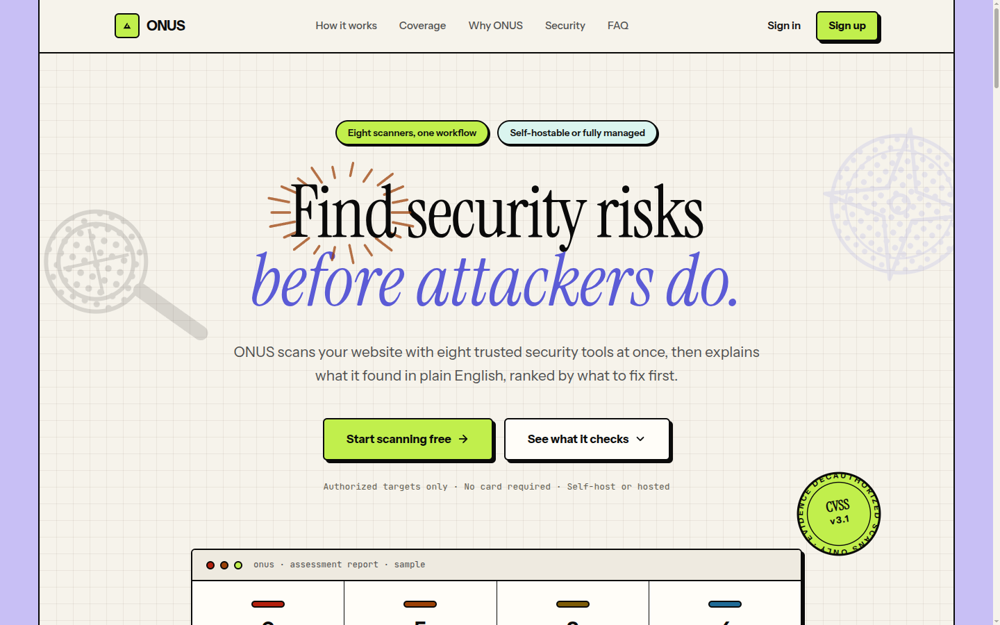
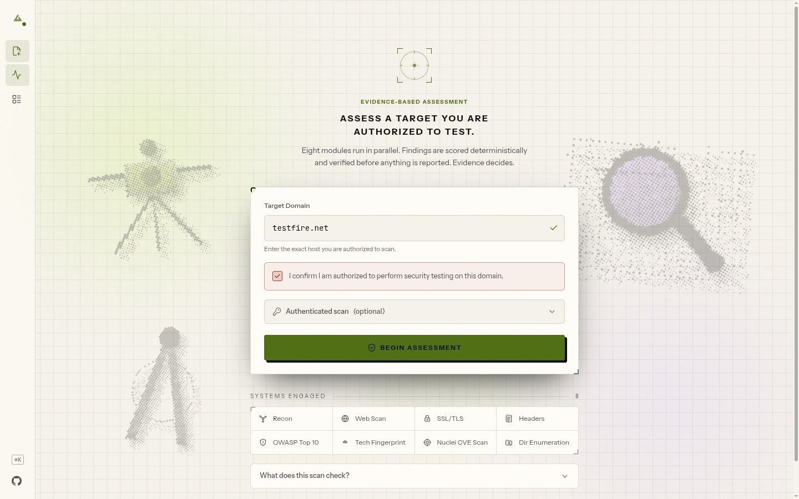
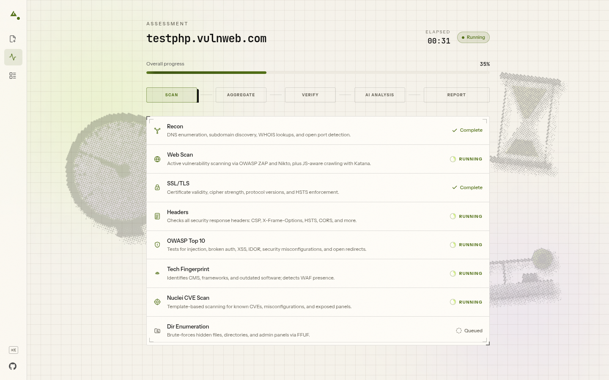
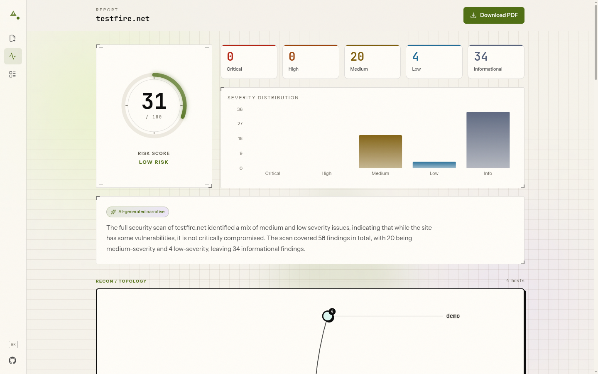
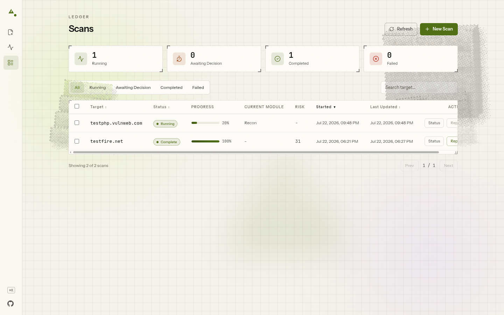
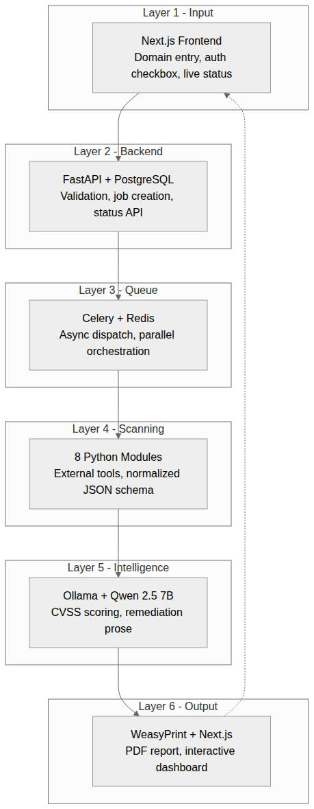

# ONUS - Automated Vulnerability Assessment & Penetration Testing

[](LICENSE)
[](https://github.com/maverickaayush/ONUS/actions/workflows/ci.yml)

<p align="center">
  <a href="https://tryonus.tech"></a>
</p>

Built by [maverickaayush](https://github.com/maverickaayush).

A locally-hosted, air-gapped VAPT tool: point it at an authorized target
domain and it runs 8 scanning modules in parallel, deterministically scores
every finding (CVSS v3.1), optionally adds AI-generated plain-English
descriptions via a local LLM, and produces a PDF report plus a live web
dashboard. No external API calls - everything runs on your own network.

> **Two ways to run ONUS:**
> - **Self-hosted (this repo):** `docker compose up` → enter a domain → tick the
>   authorization box → scan. No account, no sign-in, no email verification -
>   it's single-operator by design, and everything below covers this path.
> - **Hosted:** a managed instance is live at **[tryonus.tech](https://tryonus.tech)**.
>   It layers on production-only features (accounts / OAuth sign-in, a scan
>   queue, per-user history) that default **off** in this repo, so self-hosting
>   stays simple. See [Self-hosted vs hosted](#self-hosted-vs-hosted).

## Features

- **8 parallel scanning modules** (Celery) - network recon
  (ports/services/subdomains/DNS/WHOIS), web app scanning (ZAP + Nikto +
  Katana), SSL/TLS config, HTTP security headers, OWASP Top 10 checks, tech
  fingerprinting/WAF detection, CVE scanning (Nuclei), directory enumeration
  (FFUF).
- **Deterministic CVSS v3.1 scoring** - severity, CVSS score/vector,
  priority, and OWASP category are computed from a rule catalogue, never
  guessed by an LLM. Two runs of the same scan produce byte-identical
  numeric fields.
- **Confidence verification** - findings are passively re-checked
  (non-destructive re-observation only) and tagged confirmed / probable /
  unverified rather than silently dropped.
- **Optional local AI analysis** - Ollama + Qwen 2.5 7B turns scored
  findings into plain-English descriptions and remediation steps. Fully
  air-gapped; the tool works without it (see Quick start below).
- **Context-aware, actionable remediation** - every finding ends with a
  concrete next step. Stable issues use deterministic templates; genuinely
  context-dependent ones use the AI; and managed-platform detection
  (Vercel / Cloudflare / Netlify / GitHub Pages / …) means a platform-owned
  TLS finding says who controls that layer and what to do next, instead of
  impossible "edit your server config" advice.
- **PDF report + web dashboard** - WeasyPrint-rendered report and a Next.js
  dashboard, both driven by the same scored/described findings.

## Technical write-up

[**Where the LLM Stops: Deterministic Scoring in an AI-Assisted VAPT Pipeline**](https://aayushyadav.hashnode.dev/where-the-llm-stops-deterministic-scoring-in-an-ai-assisted-vapt-pipeline)

A technical deep dive into ONUS's architecture, passive confidence verification, deterministic CVSS scoring, and the boundary between security-critical logic and LLM-assisted explanations and remediation.

## Self-hosted vs hosted

|  | Self-hosted (this repo) | Hosted ([tryonus.tech](https://tryonus.tech)) |
|---|---|---|
| Setup | `docker compose up` | none - just open the site |
| Sign-in | **none** - single operator | account / Google / GitHub OAuth |
| Scan flow | domain → authorization box → scan | same, after signing in |
| Extras | - | scan queue, per-user history, hosted email |
| Runs on | your own network, air-gapped | managed cloud |

The self-hosted default path is intentionally the simple one: **no sign-up, no
email verification, no OAuth**. The hosted-only features (authentication, scan
queue) live behind config flags that default **off** (`REQUIRE_AUTH=false`,
`HOSTED_QUEUE_ENABLED=false`; see [Configuration](#configuration)) and are not
set in `docker-compose.yml` - so running ONUS locally never puts you behind a
login. Prefer zero setup? Use the hosted site at
**[tryonus.tech](https://tryonus.tech)**.

## Screenshots

| New Scan | Live Scan Status |
|---|---|
|  |  |

| Report Dashboard | Scans Discovery |
|---|---|
|  |  |

## Architecture

```
domain → [recon | webscan | ssl_tls | headers | owasp | tech_fingerprint | nuclei | enumeration] (parallel, Celery)
       → any module failed/timed out? → pause for operator retry/continue/cancel
       → aggregator (dedup + OWASP-map + sort)
       → confidence verification (passive re-observation)
       → deterministic CVSS scoring
       → Ollama (Qwen 2.5 7B) AI analysis
       → WeasyPrint PDF + PostgreSQL
       → dashboard / PDF download
```



Six layers: Next.js frontend → FastAPI → Celery/Redis → 8 parallel scanning
modules → Ollama (Qwen 2.5 7B) → WeasyPrint PDF + dashboard. Full details in
[`ARCHITECTURE.md`](ARCHITECTURE.md) (schemas, contracts, guardrails) and
[`docs/QUICK_REF.md`](docs/QUICK_REF.md) (quick lookup for common changes).

## Prerequisites

- Docker + Docker Compose v2
- **~8GB free disk.** The built images total ~6.8GB (backend and worker are
  ~3.25GB each - they bundle Nuclei templates and a headless Chromium via
  Playwright - plus a ~270MB frontend), and the build itself needs headroom
  on top.
- **~6GB free RAM.** The ZAP sidecar alone is capped at 4GB (`mem_limit: 4g`),
  and Postgres, Redis, the API, the worker and the frontend run alongside it.
- First build takes roughly 10-15 minutes on a decent connection.

## Quick start

> See Prerequisites above: ~8GB disk and ~6GB RAM, and expect a 10-15 minute
> first build.

```bash
cp .env.example .env
cp backend/subfinder-config/provider-config.yaml.example backend/subfinder-config/provider-config.yaml
docker compose up -d
docker compose ps        # wait for zap to report healthy (~2 min)
```

Open **http://localhost:3000**, enter a domain, tick the authorization box, and
start the scan.

**No sign-in, sign-up, or email verification.** Self-hosted ONUS is
single-operator by default - there's no account step between opening the
dashboard and scanning.

**This works with no Ollama install.** CVSS/severity/priority scoring is
always deterministic (`analysis/cvss_scorer.py`) - without Ollama running,
findings just get a rule-based description template instead of AI-generated
prose. See "Optional: enable AI-generated descriptions" below to turn that on.

**Zero API keys are required to run this tool.** Every scanning tool it
wraps (nmap, ZAP, Nikto, testssl.sh, Nuclei, Amass, Naabu, httpx, WhatWeb,
WAFW00F, FFUF) and Ollama itself work with no key at all. The subfinder
config copy step above is the one optional exception - leaving it as the
empty template is fine, subfinder just runs with free/public sources only.
To deepen subdomain enumeration, you can add up to two free-tier keys to
that file before starting: a GitHub personal access token and a
[ProjectDiscovery Chaos](https://chaos.projectdiscovery.io) API key - see
the comments inside `provider-config.yaml.example`.

## Optional: enable AI-generated descriptions

Ollama runs **natively on the host** (not in Docker) so it can use the
host's GPU directly; containers reach it via `host.docker.internal`.

1. Install Ollama on the host: https://ollama.com/install.sh
2. Pull the model: `ollama pull qwen2.5:7b`
3. **Make Ollama reachable from Docker containers** (Ollama defaults to
   `127.0.0.1`-only, which Docker's bridge network cannot reach):
   ```bash
   sudo systemctl edit ollama
   ```
   Add under `[Service]`:
   ```ini
   [Service]
   Environment="OLLAMA_HOST=0.0.0.0:11434"
   ```
   Save, then:
   ```bash
   sudo systemctl daemon-reload && sudo systemctl restart ollama
   ```
   Note: this makes Ollama reachable from your local network, not just
   Docker - fine on a personal machine, worth a firewall rule on a shared one.
4. Verify: `curl http://localhost:11434/api/tags`
5. Restart the backend/worker so they pick it up: `docker compose restart backend worker`

## Optional: practice targets

The compose file also defines 12 intentionally-vulnerable practice apps
(Juice Shop, DVWA, bWAPP, Mutillidae, NodeGoat, DVWP/WordPress behind a
ModSecurity WAF, Metasploitable2, WebGoat) for trying the scanner against
something without needing your own authorized target. They're gated behind
a Compose profile so they never build/start by default:

```bash
docker compose --profile targets up -d
```

**Warning: these are intentionally-vulnerable, some genuinely backdoored,
services** (Metasploitable2 ships a live vsftpd backdoor). Only run the
`targets` profile on a machine that isn't reachable from the internet or a
shared network - never on a public cloud instance or an exposed host.

Most of these run from prebuilt images and need nothing extra. Two -
`nodegoat` and `dvwp-wordpress` - build from source that isn't vendored into
this repo and must be cloned first:

```bash
git clone https://github.com/OWASP/NodeGoat nodegoat-src
git clone https://github.com/vavkamil/dvwp dvwp-src
```

Published ports once running: Juice Shop `:3001`, DVWA `:8081`, bWAPP
`:8083`, Mutillidae `:8084`, NodeGoat `:8085`, DVWP (via WAF, TLS) `:8444`,
WebGoat `:8082`. Metasploitable2 publishes no host port (reachable only from
`backend`/`worker` over Docker's internal network) since it exposes real
backdoored/unauthenticated network services.

## Configuration

Env vars, set via `.env` (copied from `.env.example`):

| Variable | Default | Purpose |
|---|---|---|
| `POSTGRES_PASSWORD` | `vapt_secure_2025` | Database password |
| `SECRET_KEY` | `change_me_to_a_long_random_string` | Backend secret key |
| `ALLOWED_HOSTS` | `localhost,127.0.0.1` | FastAPI allowed hosts |
| `OLLAMA_URL` | `http://host.docker.internal:11434` | Where the backend/worker reach Ollama |
| `SCAN_TIMEOUT_MULTIPLIER` | `1.5` | Scales every module's tool/Celery timeout - real-world targets are slower than lab targets; drop to `1.0` for lab-tuned timings |
| `MAX_CONCURRENT_SCANS` | `3` | Concurrent-scan cap (resource-exhaustion / target-politeness guard, also sizes the DB connection pool) |
| `ONUS_ENV` | `development` | `development` (self-hosted localhost — weak secrets only warn) or `production` (weak `SECRET_KEY`/Postgres password become a hard boot failure) |

**The `POSTGRES_PASSWORD`/`SECRET_KEY` defaults above are demo-only** -
they're fine for a local/personal instance but change both before deploying
anywhere reachable by anyone else. This is now *enforced*, not just advised:
set `ONUS_ENV=production` (or turn on hosted auth) and the backend **refuses to
start** while either is still a default/placeholder. Generate a strong key with
`python -c "import secrets; print(secrets.token_urlsafe(48))"`.

**Hosted-only features are off by default.** `REQUIRE_AUTH` (accounts / OAuth
sign-in) and `HOSTED_QUEUE_ENABLED` (scan queue) both default to `false` and
aren't set in `docker-compose.yml`, so self-hosted ONUS never gates you behind
a login or a queue. Leave them off unless you're intentionally building a
multi-user hosted deployment - the managed [tryonus.tech](https://tryonus.tech)
instance is the one that turns them on.

## Analytics (optional)

ONUS has **no analytics by default** - nothing loads and no data leaves the
browser. To collect anonymous product-usage metrics on your own deployment,
set a single Google Analytics 4 Measurement ID:

```bash
NEXT_PUBLIC_GA_ID=G-XXXXXXXXXX
```

It's a frontend build-time variable, so set it in the frontend build
environment (a Vercel/host env var, or `frontend/.env.local` for a local
`npm run build`). When set, GA loads **only in production builds** and tracks
page views plus a few product events (e.g. `scan_started`, `scan_completed`,
`report_downloaded`). Custom events go through the typed helper in
[`frontend/lib/analytics.ts`](frontend/lib/analytics.ts) -
`trackEvent('scan_started')`.

**Privacy:** only anonymous, low-cardinality usage events are sent - never
scanned domains, scan results, findings, report contents, the authorization
state, or any personal data. Leave `NEXT_PUBLIC_GA_ID` unset and ONUS behaves
exactly as before; analytics is entirely opt-in.

## API docs

FastAPI generates interactive Swagger docs for free - once the backend is
running, open **http://localhost:8000/docs**.

## Stop

```bash
docker compose down
```

## Logs

```bash
docker compose logs -f backend worker
```

## Testing & Validation

```bash
pip install -r backend/requirements-dev.txt
pytest backend/tests
```

655 automated backend tests as of this writing. Beyond the unit/integration
suite, the tool has been exercised end-to-end during development: 79 real
scans executed and 124 PDF reports generated against nine deliberately-
vulnerable practice applications (DVWA, Juice Shop, Mutillidae, NodeGoat,
bWAPP, WebGoat, Metasploitable2, DVWP/WordPress behind a WAF) plus one
authorized public target (`testphp.vulnweb.com`) - not hypothetical numbers.
Only ever scan targets you are explicitly authorized to test - see
[`docs/test_findings.md`](docs/test_findings.md) for the practice targets
used during development.

## Documentation

- [`ARCHITECTURE.md`](ARCHITECTURE.md) - full architecture, schemas, and
  the contracts a change should never break. Read this before making a
  non-trivial change.
- [`docs/QUICK_REF.md`](docs/QUICK_REF.md) - run commands, folder
  responsibilities, "where do I make this change."
- [`docs/scanners.md`](docs/scanners.md) - reasoning behind each scanning
  module's timing/flag design.
- [`docs/ai.md`](docs/ai.md) - Ollama timeout/context tuning, why scoring
  moved off the LLM entirely.
- [`docs/docker.md`](docs/docker.md) - Docker deviation notes and build
  gotchas.
- [`docs/troubleshooting.md`](docs/troubleshooting.md) - how to manually
  test any module/stage in isolation.
- [`docs/roadmap.md`](docs/roadmap.md) - historical build sequence
  (build is complete).
- [`CONTRIBUTING.md`](CONTRIBUTING.md) - dev setup, tests, PR expectations.

## License

MIT - see [LICENSE](LICENSE).

## Authorized use only

Scanning targets without explicit written authorization is illegal under the
IT Act 2000 (India) and equivalent international statutes. This tool
requires authorization confirmation on every scan and logs the operator +
timestamp for accountability.
